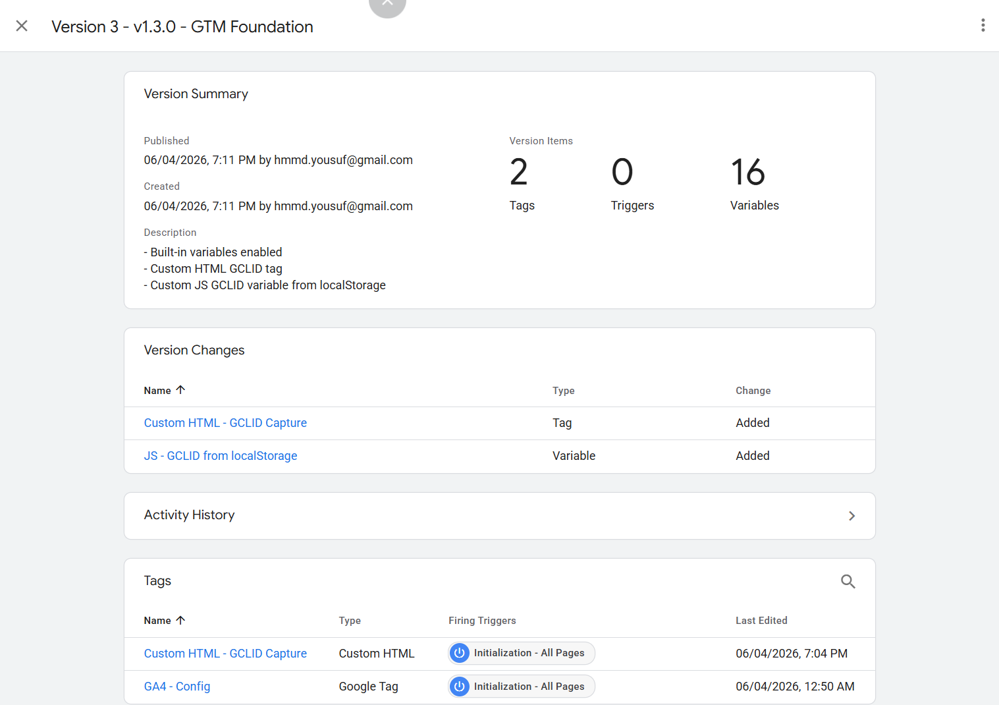
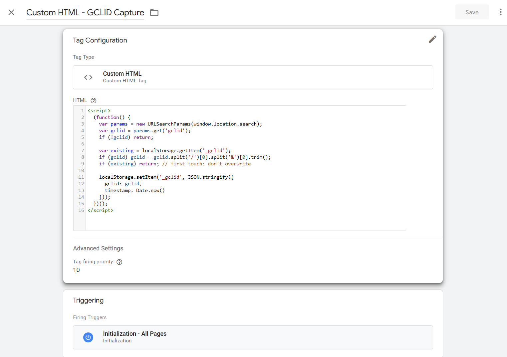
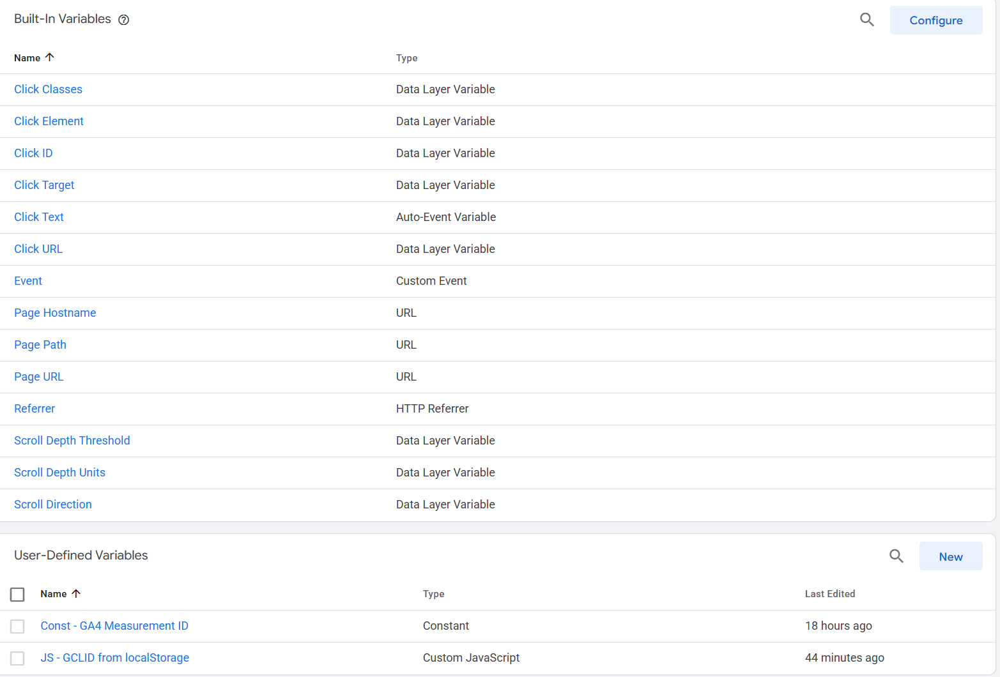
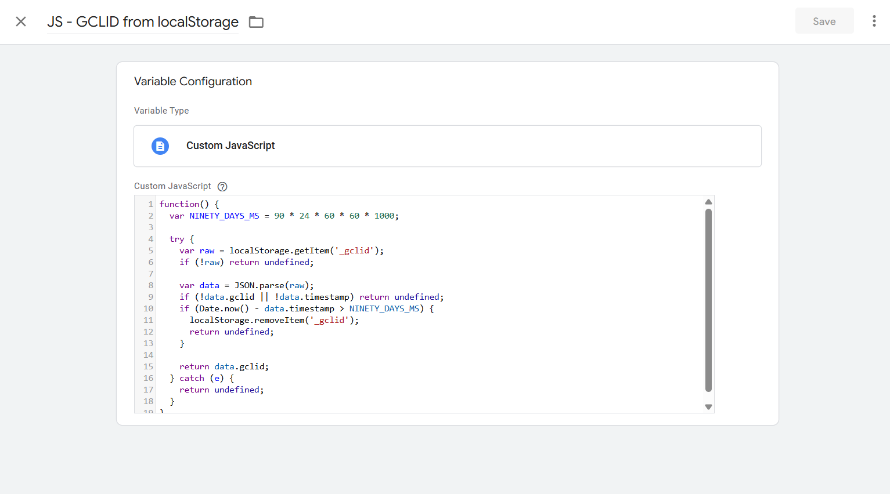
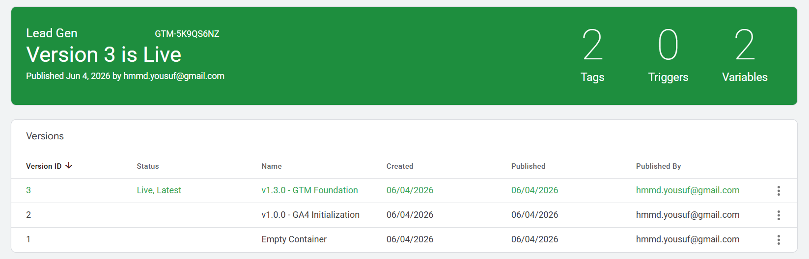
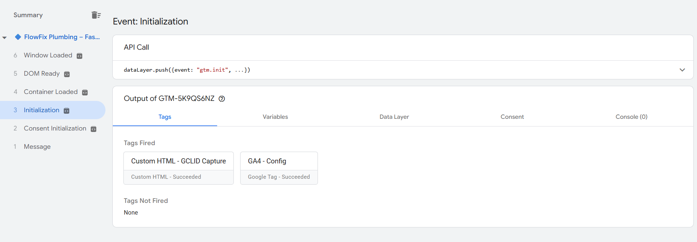
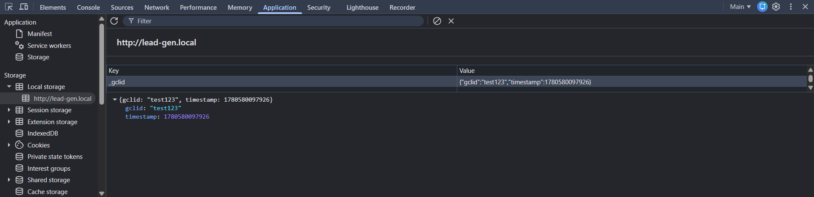

# 1.3 GTM Foundation

## What This Does & Why

Before any conversion tracking can happen, the GTM container needs a clean, consistent baseline: the right variables enabled, a working GA4 Config tag, and GCLID capture in place. Without GCLID capture at this stage, every subsequent conversion event — form submissions, call clicks, Calendly bookings — will be unattributable when imported into Google Ads offline. The GCLID is the join key between an ad click and a CRM record; if it isn't captured on first landing, it's gone.

This subproject establishes the full GTM foundation for the Lead Gen demo site: all Built-in Variables enabled, the GA4 Config tag verified, and a first-touch GCLID capture tag that stores the click ID in `localStorage` with a timestamp for 90-day expiry validation. Every subsequent subproject in Phase 1 builds on top of this baseline.

## Prerequisites

- [ ] GTM container `Lead Gen` (GTM-5K9QS6NZ) installed on site via GTM4WP plugin — confirmed firing in Preview mode
- [ ] GA4 property `Lead Gen Demo` (G-VH9CHBBWR7) created with web data stream pointing to `http://lead-gen.local`
- [ ] WordPress site running at `http://lead-gen.local` (LocalWP)
- [ ] GTM4WP plugin active — this determines tag load order (see note below)
- [ ] 1.1 Measurement Plan complete
- [ ] 1.2 Data Layer Specification complete

> **Load order note:** GTM4WP initialises `dataLayer` and fires the GTM `<head>` snippet **before** WPCode header snippets. Any code that needs to run before GTM (e.g., pre-GTM dataLayer pushes) cannot use WPCode header placement — use GTM Custom HTML tags or WPCode footer instead. Verified by inspecting page source.

## Business Requirement

Capture the Google Click ID (GCLID) on first ad-click landing and persist it in `localStorage` so it can be passed with every subsequent conversion event and used for offline conversion imports into Google Ads.

## Data Layer Specification

### Event Name

No dataLayer push is used in this subproject. The GCLID capture tag reads directly from `window.location.search` and writes to `localStorage`. It does not push to the dataLayer.

### Event Parameters

N/A — no dataLayer event.

### Full dataLayer Code

N/A — see GTM Setup below for the Custom HTML tag code.

## GTM Setup



### Step-by-Step Instructions

**Part 1: Enable Built-in Variables**

1. In the GTM workspace, go to **Variables** in the left nav
2. Under Built-In Variables, click **Configure**
3. Enable all variable groups: Clicks, Forms, History, Scrolling, Videos, Visibility, Errors, Utilities
4. Click **Save**

**Part 2: Verify GA4 Config tag**

The GA4 Config tag was created in the previous session (v1.0.0 — GA4 Initialization). Confirm it exists and is configured correctly before proceeding.

1. Go to **Tags**
2. Open `GA4 - Config`
3. Confirm:
   - Tag type: Google Tag
   - Tag ID: `{{Const - GA4 Measurement ID}}` (resolves to `G-VH9CHBBWR7`)
   - Trigger: `Initialization - All Pages`
4. No changes needed — leave as-is

**Part 3: Create the GCLID Capture tag**

1. Go to **Tags → New**
2. Tag name: `Custom HTML - GCLID Capture`
3. Tag type: **Custom HTML**
4. Paste the following code:

```html
<script>
  (function () {
    var params = new URLSearchParams(window.location.search);
    var gclid = params.get("gclid");
    if (!gclid) return;

    // Sanitise: strip anything after / or & (prevents GTM debug param pollution)
    gclid = gclid.split("/")[0].split("&")[0].trim();

    var existing = localStorage.getItem("_gclid");
    if (existing) return; // first-touch: don't overwrite

    localStorage.setItem(
      "_gclid",
      JSON.stringify({
        gclid: gclid,
        timestamp: Date.now(),
      }),
    );
  })();
</script>
```

5. Under **Advanced Settings → Tag firing priority**: set to `10`
6. Trigger: `Initialization - All Pages`
7. Save

> **Why priority 10?** GTM fires tags on the same trigger in unspecified order by default. Priority 10 ensures GCLID is captured before any other tags that may eventually read it (Enhanced Conversions, Offline Import tags).

> **Why sanitise the GCLID value?** During development with GTM Preview mode active, the preview appends `?gtm_debug=...` to URLs. If the original URL already has `?gclid=...`, GTM Preview can corrupt the value (e.g., `test123/?gtm_debug=1780578496158`). The `.split('/')[0].split('&')[0].trim()` strips anything after a `/` or `&`, leaving only the clean GCLID string.

> **Why first-touch?** For offline conversion imports, Google Ads needs the GCLID from the original ad click that initiated the session — not a subsequent click. First-touch preserves the attribution source.

**Part 4: Create the GCLID read variable**

1. Go to **Variables → New** (User-Defined Variables section)
2. Variable name: `JS - GCLID from localStorage`
3. Variable type: **Custom JavaScript**
4. Paste:

```javascript
function() {
  var NINETY_DAYS_MS = 90 * 24 * 60 * 60 * 1000;

  try {
    var raw = localStorage.getItem('_gclid');
    if (!raw) return undefined;

    var data = JSON.parse(raw);
    if (!data.gclid || !data.timestamp) return undefined;
    if (Date.now() - data.timestamp > NINETY_DAYS_MS) {
      localStorage.removeItem('_gclid');
      return undefined;
    }

    return data.gclid;
  } catch (e) {
    return undefined;
  }
}
```

5. Save

> **Why 90 days?** Google Ads only accepts offline conversion imports within 90 days of the original click. Returning `undefined` after expiry prevents stale GCLIDs from polluting import files. The expired entry is also actively removed so a future click can write a fresh one. The `try/catch` handles Safari ITP or other environments where `localStorage` is blocked — fails silently rather than breaking other tags.

### Tag Configuration



**Tag type:** Custom HTML
**Tag name:** `Custom HTML - GCLID Capture`
**Key settings:**

- Tag firing priority: 10
- Trigger: Initialization - All Pages

### Trigger Configuration

No new triggers created in this subproject. Both tags reuse the built-in `Initialization - All Pages` trigger.

**Trigger type:** Initialization
**Trigger name:** `Initialization - All Pages` (built-in)

### Variable Configuration





**Variable 1 (existing):**

- Name: `Const - GA4 Measurement ID`
- Type: Constant
- Value: `G-VH9CHBBWR7`

**Variable 2 (new):**

- Name: `JS - GCLID from localStorage`
- Type: Custom JavaScript
- Returns: `string` (the GCLID value) or `undefined`

**Built-in Variables enabled (16 total):** Click Classes, Click Element, Click ID, Click Target, Click Text, Click URL, Event, Page Hostname, Page Path, Page URL, Referrer, Scroll Depth Threshold, Scroll Depth Units, Scroll Direction, and all remaining groups (video, visibility, errors, utilities).

### GTM Version

**Version number:** 3
**Version name:** `v1.3.0 - GTM Foundation`
**Published:** 2026-06-04
**Container export:** `gtm/GTM-5K9QS6NZ_v1.json`



## GA4 Configuration

The GA4 Config tag fires a `page_view` event automatically on every page via the `Initialization - All Pages` trigger. No additional GA4 configuration is required for this subproject.

- **Event name:** `page_view` (automatic)
- **Marked as conversion:** No
- **Custom dimensions registered:** None (done in 1.4 GA4 Foundation)

## Google Ads Configuration

N/A — no Google Ads tags or conversion actions in this subproject. Google Ads foundation is covered in 1.5.

## Validation Steps



1. Open GTM Preview → enter `http://lead-gen.local/?gclid=test123` as the URL
2. Confirm the Initialization event fires first in the event stream
3. Under the Initialization event, check the Tags tab — both `Custom HTML - GCLID Capture` (fired) and `GA4 - Config` (fired) should appear
4. Check the Variables tab — `JS - GCLID from localStorage` should return `"test123"`
5. Open Chrome DevTools → Application → Local Storage → `http://lead-gen.local`
6. Confirm key `_gclid` exists with value: `{"gclid":"test123","timestamp":[unix timestamp]}`



7. Clear localStorage (`_gclid` key), reload the page **without** `?gclid=` in the URL
8. Confirm `_gclid` is NOT written to localStorage (no GCLID in URL = no write)
9. Load `?gclid=test123` again to write it, then reload with `?gclid=test456`
10. Confirm localStorage still contains `test123` (first-touch guard: existing value not overwritten)

## QA Checklist

- [ ] All Built-in Variable groups enabled (16 variables visible in Variables tab)
- [ ] `GA4 - Config` tag fires on Initialization — confirmed in Preview mode
- [ ] `Custom HTML - GCLID Capture` tag fires on Initialization — confirmed in Preview mode
- [ ] GCLID capture tag has firing priority 10
- [ ] GCLID captured correctly when `?gclid=test123` in URL
- [ ] GCLID value is clean (no GTM debug param contamination)
- [ ] `_gclid` localStorage key contains valid JSON with `gclid` and `timestamp` fields
- [ ] `JS - GCLID from localStorage` variable returns the GCLID string in Preview mode
- [ ] First-touch guard works: existing `_gclid` not overwritten on second visit with different GCLID
- [ ] No GCLID written when URL has no `gclid` parameter
- [ ] GTM version 3 published and named `v1.3.0 - GTM Foundation`
- [ ] Container JSON exported to `gtm/GTM-5K9QS6NZ_v1.json`

## Common Errors & Fixes

| Error / Symptom                                                           | Root Cause                                                                                                      | Fix                                                                                           |
| ------------------------------------------------------------------------- | --------------------------------------------------------------------------------------------------------------- | --------------------------------------------------------------------------------------------- |
| `_gclid` value contains `test123/?gtm_debug=...`                          | GTM Preview appends `?gtm_debug` to the URL; if the URL already has `?gclid=...`, the parameter value bleeds in | Add `.split('/')[0].split('&')[0].trim()` after `params.get('gclid')` to sanitise the value   |
| `JS - GCLID from localStorage` returns `undefined` even with GCLID in URL | GCLID capture tag has not fired yet when the variable is evaluated, OR `localStorage` is blocked                | Confirm capture tag fires before the variable is read; check browser privacy settings         |
| GCLID not captured on return visits                                       | First-touch guard working correctly — expected behaviour                                                        | If last-touch is needed instead, remove the `if (existing) return;` guard                     |
| `localStorage` writes fail silently in Safari                             | ITP blocks `localStorage` in some Safari private/cross-site contexts                                            | The `try/catch` in the read variable handles this gracefully; no fix needed for demo purposes |
| GA4 Config tag not appearing in Preview                                   | GTM snippet not on page or container ID mismatch                                                                | Confirm GTM4WP plugin is active and container ID matches `GTM-5K9QS6NZ`                       |

## Reusable Assets

- **GTM Container Export:** `project-lead-gen/gtm/GTM-5K9QS6NZ_v1.json`
- **GCLID Capture snippet:** Embedded in GTM Custom HTML tag — no separate snippet file (GTM-only implementation, no dataLayer push)

## Related Guides

- `google-ads-measurement-library/docs/guides/02-data-collection/gtm/tags-triggers-variables.md` — GTM workspace fundamentals extracted from this subproject
- `google-ads-measurement-library/docs/guides/05-crm-offline/gclid-capture.md` — GCLID capture pattern in depth (expanded in 1.19)
- `project-lead-gen/docs/02-data-layer-spec.md` — Data layer specification (upstream dependency)
- `project-lead-gen/docs/04-ga4-foundation.md` — GA4 property configuration (next subproject)
