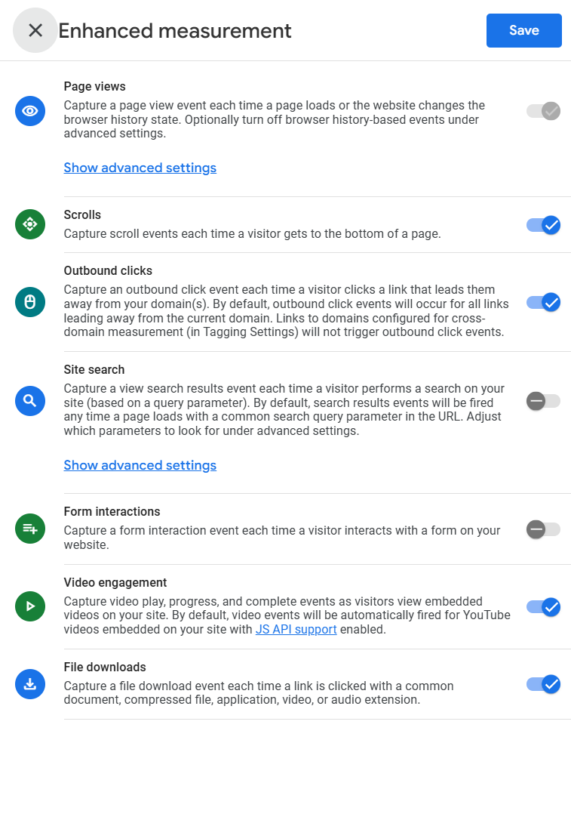
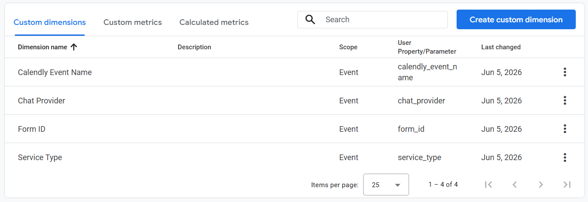
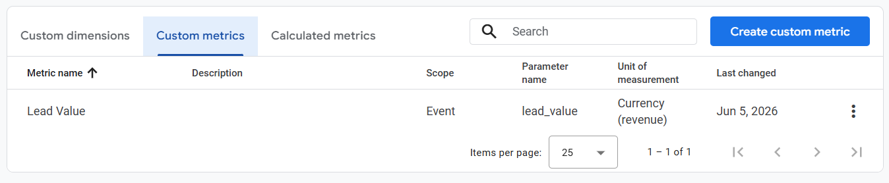
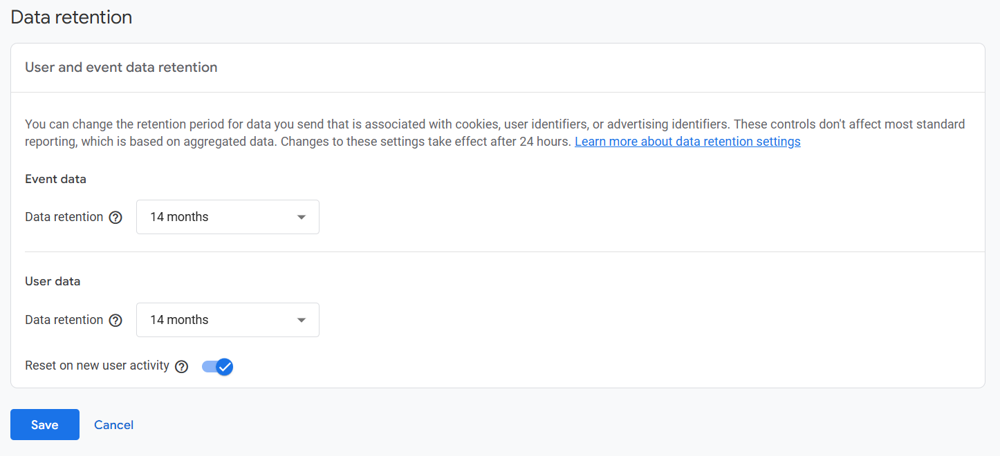
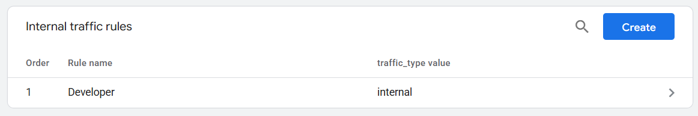
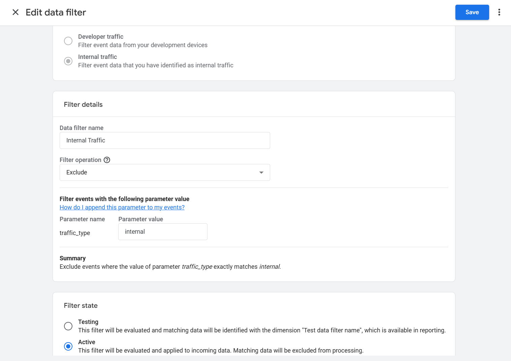
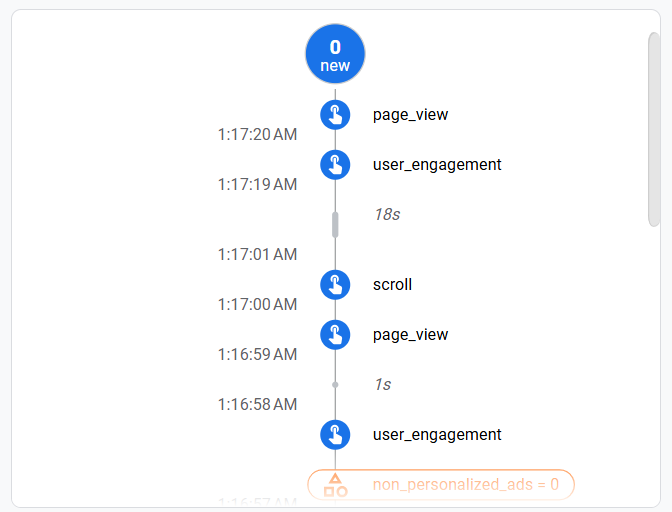

# 1.4 GA4 Foundation

## What This Does & Why

A GA4 property created with default settings is not ready for serious measurement work. The default data retention window is 2 months (crippling Explorations), enhanced measurement sends noisy form events that conflict with custom tracking, internal test traffic inflates every report, and custom event parameters are invisible in the UI until explicitly registered. None of this breaks tracking — but it silently degrades data quality and reporting usefulness from day one.

This subproject locks in the correct GA4 property configuration before any conversion events are implemented: enhanced measurement tuned to avoid conflicts with custom pushes, all event parameters registered as custom dimensions and metrics, 14-month data retention, and an active internal traffic filter. Every subsequent subproject in Phase 1 benefits from this baseline being correct.

## Prerequisites

- [ ] GA4 property `Lead Gen Demo` (G-VH9CHBBWR7) created with web data stream pointing to `http://lead-gen.local`
- [ ] GTM Foundation (1.3) complete — GA4 Config tag confirmed firing
- [ ] All events in the data layer spec finalised (1.2) — custom dimension list derived from this
- [ ] Your current public IP known (`whatismyip.com`)

## Business Requirement

Configure the GA4 property so that data retention, event parameter visibility, enhanced measurement behaviour, and internal traffic exclusion are all set correctly before any conversion events begin flowing.

## Data Layer Specification

### Event Name

N/A — this subproject involves GA4 property configuration only. No new events are implemented here.

### Event Parameters

N/A

### Full dataLayer Code

N/A

## GTM Setup

N/A — no GTM changes in this subproject. All work is done inside GA4 Admin.

### Step-by-Step Instructions

N/A

### Tag Configuration

N/A

### Trigger Configuration

N/A

### Variable Configuration

N/A

### GTM Version

No new GTM version published in this subproject.

## GA4 Configuration

All configuration is done in GA4 Admin. Navigate via the cog icon (bottom left) in GA4.

---

### Part 1 — Enhanced Measurement

**Path:** Admin → Data Streams → `http://lead-gen.local` → Enhanced Measurement (toggle gear icon)

**Settings:**

| Toggle            | State  | Reason                                                                                                                     |
| ----------------- | ------ | -------------------------------------------------------------------------------------------------------------------------- |
| Page views        | ✅ On  | Required — tracks all pageviews automatically                                                                              |
| Scrolls           | ✅ On  | Useful micro-conversion signal (90% scroll depth)                                                                          |
| Outbound clicks   | ✅ On  | Tracks clicks leaving the site — useful for partner/referral analysis                                                      |
| Site search       | ❌ Off | No search functionality on this site — would never fire                                                                    |
| Video engagement  | ✅ On  | Future-proofing — no videos yet but harmless                                                                               |
| File downloads    | ✅ On  | Future-proofing — no downloads yet but harmless                                                                            |
| Form interactions | ❌ Off | **Critical:** would fire duplicate `form_submit` events alongside custom `generate_lead` pushes, polluting conversion data |

> **Why disable Form Interactions specifically?** GA4's auto-detected `form_submit` fires on any form submit, regardless of success or failure. Your custom `generate_lead` push fires only on CF7's `wpcf7mailsent` event (confirmed successful submission). Leaving both on means every form submission generates two events — one with rich parameters, one bare. Disable the auto-detection and keep the custom push as the sole source.

---

### Part 2 — Custom Dimensions

**Path:** Admin → Custom Definitions → Custom Dimensions → Create custom dimensions

Register all 4 dimensions now. Parameters with no data flowing yet are fine — GA4 will start capturing them from the first event that includes the parameter.

| Dimension name      | Event parameter       | Scope | Description                                                                  |
| ------------------- | --------------------- | ----- | ---------------------------------------------------------------------------- |
| Form ID             | `form_id`             | Event | Identifies which form was submitted (`cf7-contact`, `hubspot-contact`, etc.) |
| Service Type        | `service_type`        | Event | Service selected in dropdown (`Emergency Callout`, `Drain Unblocking`, etc.) |
| Calendly Event Name | `calendly_event_name` | Event | Name of the Calendly event type booked                                       |
| Chat Provider       | `chat_provider`       | Event | Chat platform that triggered `chat_started` (e.g. `tawkto`)                  |
| Property Type       | `property_type`       | Event | Added in 1.7 - AJAX form tracking                                            |

---

### Part 3 — Custom Metrics

**Path:** Admin → Custom Definitions → Custom Metrics → Create custom metrics

| Metric name | Event parameter | Scope | Unit     | Data type            |
| ----------- | --------------- | ----- | -------- | -------------------- |
| Lead Value  | `lead_value`    | Event | Currency | Revenue ✅ · Cost ❌ |

> **Why Revenue, not Cost?** GA4 requires a Currency metric to be classified as Revenue, Cost, or both for access restriction purposes. `lead_value` represents the estimated business value of a lead (income side) — not an advertising cost. Revenue-only is correct. This classification affects which GA4 user roles can see the metric in reports.

> **Why Currency type?** `lead_value` will eventually hold dynamic values (e.g. £150 for Boiler Repair, £75 for Drain Unblocking). Registering as Currency enables sum/average aggregation in reports. As a dimension it would only show discrete string values with no aggregation.

---

### Part 4 — Data Retention

**Path:** Admin → Data Settings → Data Retention

**Setting:** Event data retention → **14 months**

Save and confirm. This affects how far back Explorations can query. Standard reports (Acquisition, Engagement, etc.) are unaffected — they use aggregated data with no retention limit. The 14-month window enables year-over-year comparisons in Explorations from the start.

---

### Part 5 — Internal Traffic Filter

This is a two-step process: first define which IPs count as internal (in Data Streams), then activate the filter that excludes them (in Data Filters).

**Step 1 — Define the internal traffic rule:**

**Path:** Admin → Data Streams → `http://lead-gen.local` → Configure tag settings → Define internal traffic → Create

| Field                 | Value                                        |
| --------------------- | -------------------------------------------- |
| Rule name             | My IP                                        |
| `traffic_type` value  | `internal`                                   |
| IP address match type | IP address equals                            |
| IP address            | [your current public IP from whatismyip.com] |

> **Dynamic IP note:** Most residential/mobile connections have dynamic IPs that change periodically. If GA4 Realtime starts showing your visits in reports, your IP has changed — update this rule with the new IP. This is a known limitation of IP-based filtering for local dev environments.

**Step 2 — Activate the data filter:**

**Path:** Admin → Data Filters → Internal Traffic → Edit

| Field            | Value            |
| ---------------- | ---------------- |
| Filter name      | Internal Traffic |
| Filter operation | Exclude          |
| Parameter name   | `traffic_type`   |
| Parameter value  | `internal`       |
| Filter state     | **Active**       |

> **Why Active, not Testing?** Testing mode tags matching events with a dimension but doesn't exclude them — it's for validating the rule before going live. Since all traffic to `http://lead-gen.local` is your own test traffic, there's no production data to protect. Go straight to Active.

---

### Conversion Events

No conversion events are marked in this subproject. Conversions are marked in GA4 on a per-subproject basis as each tracking implementation goes live, starting with 1.6 Contact Form Tracking.

## Validation Steps

1. Open `http://lead-gen.local` in a browser (with GTM container live, not in Preview mode)
2. Go to GA4 → Reports → Realtime — confirm an active user appears
3. Go to GA4 → Admin → DebugView — confirm `page_view` event appears
4. Scroll to 90% of the page — confirm `scroll` event appears in DebugView
5. Click any outbound link (if present) — confirm `click` event appears with `outbound: true`
6. Confirm no `form_start` or `form_submit` events appear in DebugView (Form Interactions is off)
7. Go to Realtime report — confirm your session does NOT appear (internal traffic filter active)
   - If it does appear, your IP rule may not be saving correctly — re-check Step 1 path

## QA Checklist

- [ ] Enhanced Measurement: page views, scrolls, outbound clicks, video, file downloads ON
- [ ] Enhanced Measurement: site search and form interactions OFF
- [ ] Custom dimension `form_id` registered (event-scoped)
- [ ] Custom dimension `service_type` registered (event-scoped)
- [ ] Custom dimension `calendly_event_name` registered (event-scoped)
- [ ] Custom dimension `chat_provider` registered (event-scoped)
- [ ] Custom metric `lead_value` registered (event-scoped, Currency, Revenue)
- [ ] Data retention set to 14 months
- [ ] Internal traffic IP rule created with correct IP
- [ ] Internal Traffic data filter set to Active (not Testing)
- [ ] `page_view` appears in DebugView
- [ ] `scroll` event appears in DebugView after scrolling
- [ ] No `form_submit` auto-event in DebugView
- [ ] Realtime report does NOT show your own visits

## Common Errors & Fixes

| Error / Symptom                                 | Root Cause                                                     | Fix                                                                                                    |
| ----------------------------------------------- | -------------------------------------------------------------- | ------------------------------------------------------------------------------------------------------ |
| `form_submit` events appearing in DebugView     | Form Interactions toggle still on                              | Admin → Data Streams → Enhanced Measurement → disable Form Interactions                                |
| Internal traffic still showing in Realtime      | IP rule not saved correctly, or IP has changed                 | Re-check Admin → Data Streams → Configure tag settings → Define internal traffic; update IP if changed |
| Custom dimensions not appearing in GA4 reports  | Up to 24 hours for new dimensions to propagate                 | Wait; use DebugView in the meantime to confirm parameters are arriving                                 |
| `lead_value` metric not visible in Explorations | Currency metrics with Revenue type require Editor role to view | Confirm you're logged in with an Editor or Owner role on the property                                  |
| Data retention still showing 2 months           | Change not saved                                               | Re-navigate to Admin → Data Settings → Data Retention and re-save                                      |

## Reusable Assets

N/A — this subproject contains no code or exportable assets. All configuration is done via the GA4 Admin UI.

## Related Guides

- `project-lead-gen/docs/03-gtm-foundation.md` — GTM Foundation (upstream dependency)
- `project-lead-gen/docs/05-google-ads-foundation.md` — Google Ads Foundation (next subproject)
- `google-ads-measurement-library/docs/guides/03-data-processing/ga4/event-architecture.md` — GA4 event architecture extracted guide _(to be written)_
