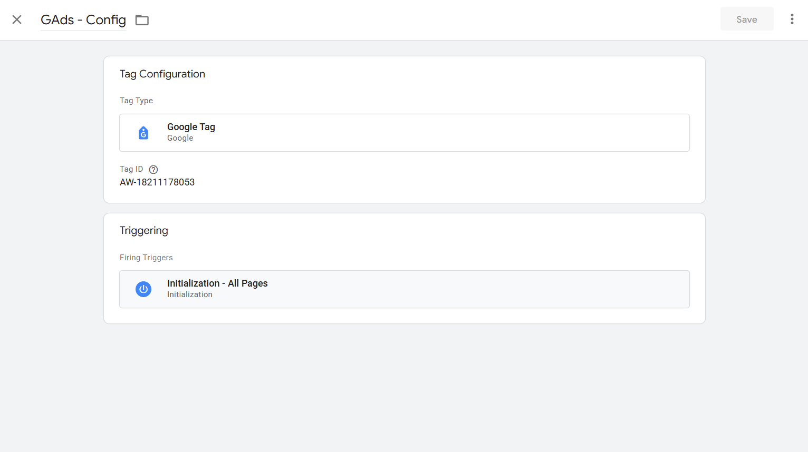
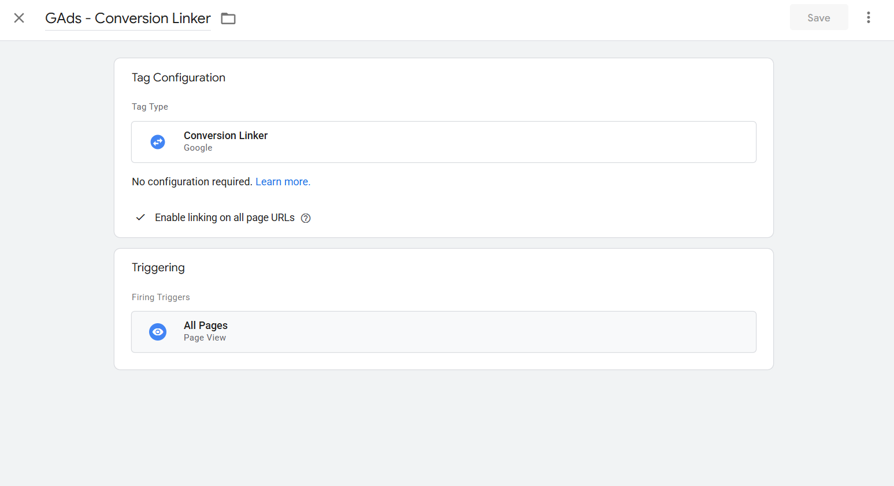
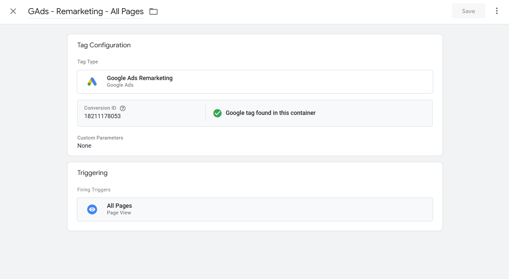
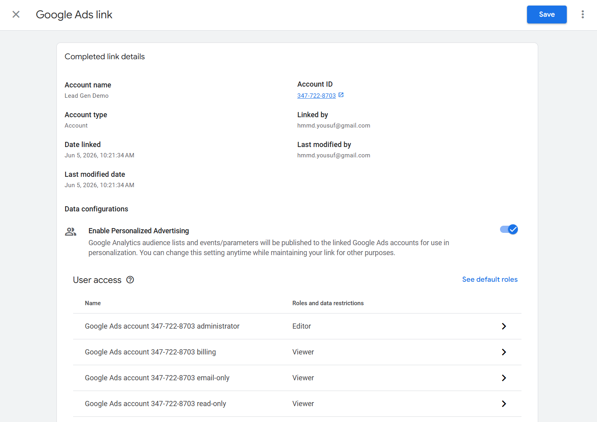

# 1.5 — Google Ads Foundation

## What This Does & Why

Before any conversion tag can fire, the Google Ads account needs a baseline measurement setup: a configuration tag, a conversion linker, and a remarketing tag — plus account-level settings that govern how all future conversions are attributed and reported.

This subproject establishes that foundation. It deploys three GTM tags that must exist before any conversion tracking can work, links the GA4 property to Google Ads for unified reporting, and documents the account-level decisions that apply to every conversion action created in subsequent subprojects.

Without the Conversion Linker, GCLIDs written to `localStorage` (from 1.3) have no companion cookie mechanism — online conversion tags would fail to match conversions to clicks. Without the Google tag (Config), the Remarketing and Conversion Tracking tags have no base configuration to reference.

## Prerequisites

- [ ] GTM container `GTM-5K9QS6NZ` published with GA4 Config tag (1.3 complete)
- [ ] GA4 property `G-VH9CHBBWR7` configured (1.4 complete)
- [ ] Google Ads child account `347-722-8703` (Lead Gen Demo) accessible under MCC `440-830-5844`
- [ ] Cross-account conversion tracking disabled in MCC (see Common Errors)
- [ ] Auto-tagging enabled in Google Ads account settings

## Business Requirement

Establish the Google Ads measurement baseline for FlowFix Plumbing. All future conversion actions (form submissions, call clicks, Calendly bookings) will fire against this foundation. The remarketing tag must be present from the start so audience data accumulates before any campaigns run.

## Data Layer Specification

Not applicable. This subproject deploys infrastructure tags only — no dataLayer events are pushed.

## GTM Setup

Three tags are required, in this sequence. The Google tag (Config) must exist before the Remarketing tag — GTM validates its presence on save.

### Tag 1 — GAds - Config

**Tag type:** Google tag  
**Tag ID:** `AW-18211178053`  
**Trigger:** Initialization - All Pages

This is the base configuration tag for all Google Ads activity in this container. It is the Google Ads equivalent of the `GA4 - Config` tag. Every Google Ads tag in subsequent subprojects references this configuration implicitly via the shared `AW-` ID.

No additional fields required.

---

### Tag 2 — GAds - Conversion Linker

**Tag type:** Conversion Linker  
**Linker Options:**

- ✅ Enable linking on all page URLs (URL passthrough — on)
- ☐ Enable linking across domains (off — single domain site)
- ☐ Override cookie settings (off)

**Trigger:** All Pages

The Conversion Linker writes the `_gcl_aw` first-party cookie containing the GCLID when a user lands from a Google Ads click. This cookie is what Google Ads conversion tags read at conversion time to match the conversion to a click.

**Why URL passthrough is enabled:** The lead gen site has a multi-page conversion flow (Home → Contact → Thank You). Safari's ITP can kill `_gcl_aw` during same-session navigation. Enabling URL passthrough appends the GCLID to all internal `<a>` hrefs as a fallback, so the GCLID travels in the URL even if the cookie is blocked.

> Note: The GCLID is also captured in `localStorage` via the `Custom HTML - GCLID Capture` tag from 1.3. That is a separate mechanism used for offline conversion imports. The Conversion Linker cookie is the primary mechanism for online conversion tags.

---

### Tag 3 — GAds - Remarketing - All Pages

**Tag type:** Google Ads Remarketing  
**Conversion ID:** `AW-18211178053`  
**Conversion Label:** (blank — general remarketing tag, not tied to a specific conversion action)  
**Send dynamic remarketing event data:** Off (ecommerce feature — not applicable for lead gen)  
**Enable Restricted Data Processing:** False (revisited in 1.15 Consent Mode)  
**Custom Parameters:** None  
**Trigger:** All Pages

Fires a pageview hit to Google Ads on every page. This populates remarketing audiences in Google Ads with site visitors. No audience definitions are created in this subproject — the tag accumulates data that can be segmented into audiences later.

---

### GTM Version

Published as **v4**, named `v1.5.0 - Google Ads Foundation`.  
Container export: `gtm/GTM-5K9QS6NZ_v2.json`

## GA4 Configuration

### GA4 → Google Ads Account Link

**Location:** GA4 Admin → Property → Google Ads Links → Link

**Linked account:** `347-722-8703` (Lead Gen Demo)  
**Personalized advertising:** Enabled

This link connects the GA4 property to the Google Ads account for:

- Google Ads cost and campaign data visible in GA4 reports
- GA4 audiences available for Google Ads targeting
- GA4 conversion events visible in Google Ads (even though conversions are tracked directly via Option A in this project)

## Google Ads Configuration

### Architecture Decision — Option A: Direct Conversion Tags

All conversion tracking in this project uses **direct Google Ads conversion tags in GTM** (Option A). Conversions are not imported from GA4.

This means:

- Each conversion action gets its own Google Ads Conversion Tracking tag in GTM
- The `AW-18211178053` Conversion ID is used across all tags
- Each conversion action has its own Conversion Label (retrieved when the action is created)

GA4 is linked for reporting and audience purposes only, not as a conversion source.

### Account-Level Settings

**Auto-tagging:** Enabled (confirmed in Admin → Account settings). This appends `gclid=` to destination URLs when users click ads — required for GCLID capture to work.

**Attribution model:** Last click — set per conversion action (not account-wide). Last click is used because the demo account lacks the conversion volume required to activate data-driven attribution (minimum 300 conversions and 3,000 ad interactions in 30 days).

> **Migrating to data-driven attribution:** Once a live account reaches sufficient volume, update each conversion action: Goals → Conversions → [action] → Edit settings → Attribution model → Data-driven. Data-driven uses ML to distribute credit across all touchpoints in the path, rather than assigning 100% to the final click. It consistently outperforms last click for accounts with sufficient data.

**Conversion windows:** Set per conversion action (not at account level — the current Google Ads UI has no account-wide default). The following windows will be applied when creating each conversion action in subsequent subprojects:

| Window        | Value   | Rationale                                                                                              |
| ------------- | ------- | ------------------------------------------------------------------------------------------------------ |
| Click-through | 90 days | Matches GCLID `localStorage` expiry from 1.3 — no point capturing a GCLID that Google Ads won't credit |
| View-through  | 1 day   | Not running Display/Video campaigns in this demo; low stakes                                           |

**Enhanced Conversions for Leads:** Not configured — set up in 1.14.

## Validation Steps

1. Open GTM Preview, load `http://lead-gen.local`
2. Confirm `GAds - Config` fires on **Initialization** event
3. Confirm `GAds - Conversion Linker` fires on **Page View** event
4. Confirm `GAds - Remarketing - All Pages` fires on **Page View** event
5. In browser DevTools → Application → Local Storage → check that `_gclid` is present (from 1.3)
6. In browser DevTools → Application → Cookies → check that `_gcl_aw` cookie is written (Conversion Linker working)
7. In GA4 Admin → Google Ads Links → confirm `347-722-8703` shows as linked

## QA Checklist

- [ ] `GAds - Config` fires on Initialization - All Pages
- [ ] `GAds - Conversion Linker` fires on All Pages
- [ ] `GAds - Remarketing - All Pages` fires on All Pages
- [ ] No tags failing in GTM Preview
- [ ] `_gcl_aw` cookie present in browser after page load
- [ ] Auto-tagging confirmed enabled in Google Ads account
- [ ] GA4 → Google Ads link active and showing `347-722-8703`
- [ ] GTM container exported as `GTM-5K9QS6NZ_v2.json`

## Common Errors & Fixes

| Error                                                                     | Cause                                                                                            | Fix                                                                                                         |
| ------------------------------------------------------------------------- | ------------------------------------------------------------------------------------------------ | ----------------------------------------------------------------------------------------------------------- |
| "Conversion goals and actions are managed by manager account"             | MCC has cross-account conversion tracking enabled, taking ownership of child account conversions | In MCC account → Admin → Account settings → disable cross-account conversion tracking for the child account |
| "Cannot detect if the Google tag is in your container" on Remarketing tag | No Google tag (Config) tag exists in the container with the matching `AW-` ID                    | Create `GAds - Config` (Google tag type) with `AW-18211178053` first, then save the Remarketing tag         |
| Child account shows "Create your first campaign" on login                 | New account onboarding wizard blocks access to full UI                                           | Scroll to bottom of page → click "Switch to Expert Mode" to bypass the wizard                               |
| `_gcl_aw` cookie not written                                              | Conversion Linker not firing, or fired after the page unloaded                                   | Confirm Conversion Linker trigger is All Pages (not a custom trigger); check GTM Preview for tag fire       |
| GCLID not appearing in URL parameters on internal links                   | URL passthrough not enabled on Conversion Linker                                                 | Edit the Conversion Linker tag → Linker Options → check "Enable linking on all page URLs"                   |

## Reusable Assets

**GTM container export:** `gtm/GTM-5K9QS6NZ_v2.json`

**Three-tag pattern for Google Ads in GTM:**
Every Google Ads implementation requires these three tags as a minimum:

1. `Google tag` (Config) — base configuration, Initialization - All Pages
2. `Conversion Linker` — GCLID cookie, All Pages, URL passthrough on
3. `Google Ads Remarketing` — audience data, All Pages

This pattern is reused in every subsequent project (Ecommerce, SaaS, Multi-Location, Enterprise B2B).

## Related Guides

- `guides/02-data-collection/gtm-foundation.md` — GCLID capture in localStorage (1.3)
- `guides/04-advertising-measurement/google-ads/conversion-actions.md` — individual conversion action setup (1.6 onward)
- `guides/04-advertising-measurement/google-ads/enhanced-conversions.md` — hashed first-party data (1.14)
