# 1.6 — Contact Form Tracking

## What This Does & Why

FlowFix Plumbing's primary lead generation mechanism is a Contact Form 7 form on the `/contact/` page. When a visitor submits that form, they become a lead — the most important conversion event in the entire measurement stack. Without tracking this event, Google Ads has no signal to optimise bidding, no data for conversion reporting, and no way to attribute leads back to campaigns.

This subproject wires the CF7 form submission to both GA4 (as a key event) and Google Ads (as a conversion action) via GTM. It uses the `wpcf7mailsent` DOM event to push a `generate_lead` event to the dataLayer at the moment of successful submission, captures the selected service type and form ID as parameters, and fires both tracking tags before the page redirects to `/thank-you/`. This is the event-based conversion pattern — compare with 1.8 (Thank You Page Tracking) which implements the page-load-based pattern on the same form for comparison purposes.

---

## Prerequisites

- [ ] GTM container at v4 (`v1.5.0 - Google Ads Foundation`) — GA4 Config, GAds Config, Conversion Linker, and Remarketing tags all deployed
- [ ] `Const - GA4 Measurement ID` variable exists in GTM (`G-VH9CHBBWR7`)
- [ ] `GAds - Config` Google tag deployed in GTM (`AW-18211178053`) — required before any Google Ads conversion tags
- [ ] GA4 property `Lead Gen Demo` (`G-VH9CHBBWR7`) with data stream for `http://lead-gen.local`
- [ ] Google Ads account `347-722-8703` (Lead Gen Demo) — child account with its own conversion tracking (MCC cross-account tracking disabled)
- [ ] Contact Form 7 installed on WordPress with a form on `/contact/` — fields: `your-name`, `your-email`, `your-phone`, `your-service`, `your-message`
- [ ] WPCode plugin installed — used to deploy the dataLayer push in the footer
- [ ] Existing WPCode snippet: CF7 redirect on `wpcf7mailsent` (updated in this subproject)
- [ ] Custom dimensions `form_id` and `service_type` registered in GA4 (done in 1.4)

---

## Business Requirement

Capture every successful CF7 form submission on `/contact/` as a `generate_lead` Google Ads conversion, with `form_id` and `service_type` parameters passed through to GA4, so that bidding can optimise toward leads and service-type segmentation is available in reporting.

---

## Data Layer Specification

### Event Name

`generate_lead`

### Event Parameters

| Parameter      | Type   | Example Value     | Notes                                                                                                                                                                           |
| -------------- | ------ | ----------------- | ------------------------------------------------------------------------------------------------------------------------------------------------------------------------------- |
| `form_id`      | string | `"cf7-contact"`   | Hardcoded identifier for this form. Used to distinguish CF7 from HubSpot/AJAX forms added in later subprojects.                                                                 |
| `service_type` | string | `"Boiler Repair"` | Value of the `your-service` dropdown at submission time. One of: `Emergency Callout`, `Drain Unblocking`, `Boiler Repair`, `Bathroom Installation`, `Other / Not Sure`.         |
| `lead_value`   | number | `0`               | Hardcoded to 0 for now. Dynamic value assignment is implemented in 1.18 Lead Quality Tracking. The GTM DLV variable is created in this subproject but not yet wired to any tag. |

> **Deferred:** `user_data.email_address` and `user_data.phone_number` are intentionally excluded from this push. They are added in 1.14 Enhanced Conversions for Leads so that subproject has meaningful work to demonstrate.

### Full dataLayer Code

This snippet replaces the existing WPCode CF7 redirect snippet entirely.

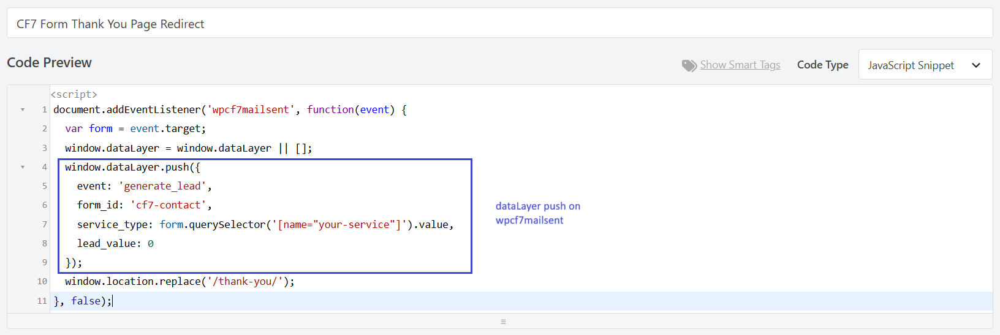

```javascript
document.addEventListener(
  "wpcf7mailsent",
  function (event) {
    var form = event.target;
    window.dataLayer = window.dataLayer || [];
    window.dataLayer.push({
      event: "generate_lead",
      form_id: "cf7-contact",
      service_type: form.querySelector('[name="your-service"]').value,
      lead_value: 0,
    });
    window.location.replace("/thank-you/");
  },
  false,
);
```

**Deployment:** WPCode → Footer → JavaScript → Active

**Why footer, not header:** GTM4WP initialises the dataLayer and fires the GTM `<head>` snippet before WPCode header snippets load. Any pre-GTM dataLayer push placed in WPCode header would run before GTM is ready. Footer placement ensures GTM is fully initialised before this listener is registered.

**Why not a GTM Custom HTML tag:** A GTM Custom HTML tag on All Pages could also register this listener, but it adds a page-scoped tag just to set up a single event listener and introduces uncertainty about listener registration order relative to WPCode. Keeping the push in the WPCode footer is simpler and keeps all CF7 logic in one place.

**Sequencing:** The `window.location.replace('/thank-you/')` call happens immediately after the dataLayer push. To prevent the page navigation from dropping GA4/Google Ads hits in flight, `transport_type: beacon` is configured on the GA4 Config tag (see GTM Setup below). Google Ads hits are protected automatically by the Google tag infrastructure.

---

## GTM Setup

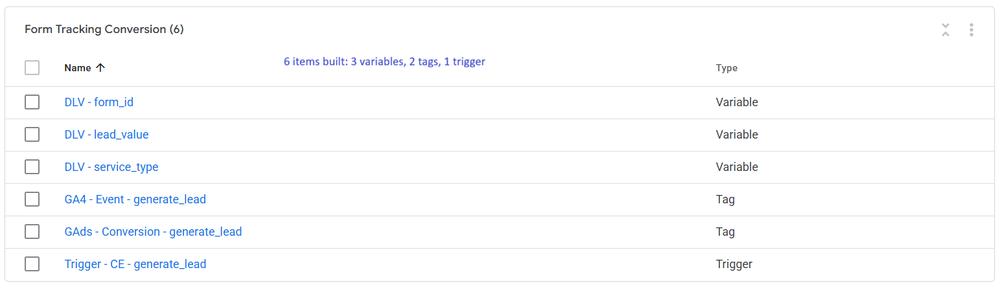

### Step-by-Step Instructions

1. Go to **Variables → New** — create `DLV - form_id` (Data Layer Variable, key: `form_id`, Version 2)
2. Go to **Variables → New** — create `DLV - service_type` (Data Layer Variable, key: `service_type`, Version 2)
3. Go to **Variables → New** — create `DLV - lead_value` (Data Layer Variable, key: `lead_value`, Version 2) — created now, not yet wired to any tag
4. Go to **Triggers → New** — create `Trigger - CE - generate_lead` (Custom Event, event name: `generate_lead`)
5. Go to **Tags → New** — create `GA4 - Event - generate_lead` (see Tag Configuration below)
6. Go to **Tags → New** — create `GAds - Conversion - generate_lead` (see Tag Configuration below)
7. Open the existing `GA4 - Config` tag → Fields to Set → add `transport_type` = `beacon` → Save
8. Go to **Preview** → submit a test form → validate (see Validation Steps)
9. Submit → name the version `v1.6.0 - Contact Form Tracking` → Publish
10. Export container JSON → `gtm/GTM-5K9QS6NZ_v3.json`

---

### Tag Configuration

#### `GA4 - Event - generate_lead`

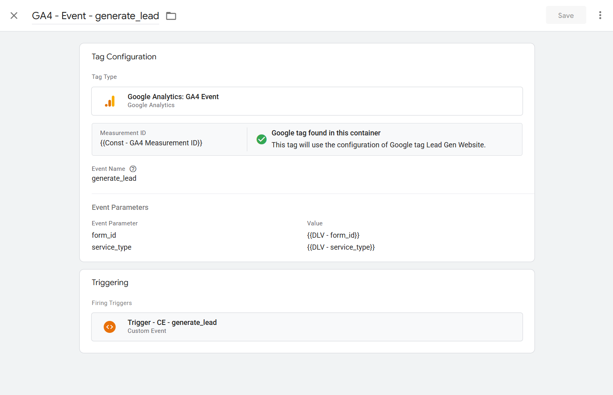

**Tag type:** Google Analytics: GA4 Event
**Tag name:** `GA4 - Event - generate_lead`

| Field                             | Value                            |
| --------------------------------- | -------------------------------- |
| Measurement ID                    | `{{Const - GA4 Measurement ID}}` |
| Event Name                        | `generate_lead`                  |
| Event Parameters → `form_id`      | `{{DLV - form_id}}`              |
| Event Parameters → `service_type` | `{{DLV - service_type}}`         |
| Trigger                           | `Trigger - CE - generate_lead`   |

> **Note on `transport_type`:** Do NOT add `transport_type` to this tag's Event Parameters. It is not an event parameter — it is a tag configuration field. Adding it to Event Parameters sends it to GA4 as a data point (visible in DebugView as a parameter with value `1`) but does not enable beacon transport. The correct location is `GA4 - Config` → Fields to Set.

---

#### `GA4 - Config` — beacon transport addition

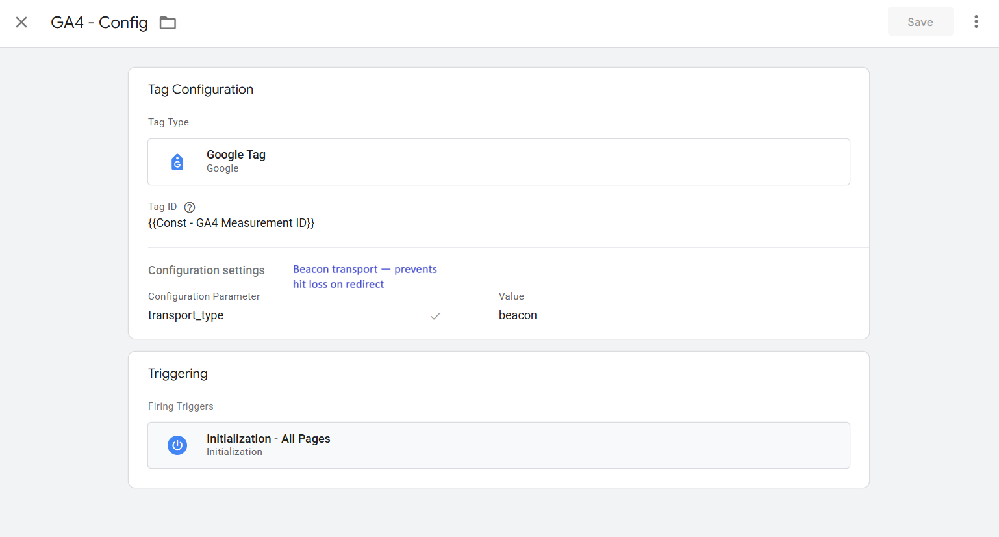

Open the existing `GA4 - Config` tag and add one entry under **Fields to Set**:

| Field Name       | Value    |
| ---------------- | -------- |
| `transport_type` | `beacon` |

This applies beacon transport to all GA4 hits from this config, meaning hits use `navigator.sendBeacon` and survive page navigation. Required because the WPCode snippet calls `window.location.replace('/thank-you/')` immediately after the dataLayer push.

---

#### `GAds - Conversion - generate_lead`

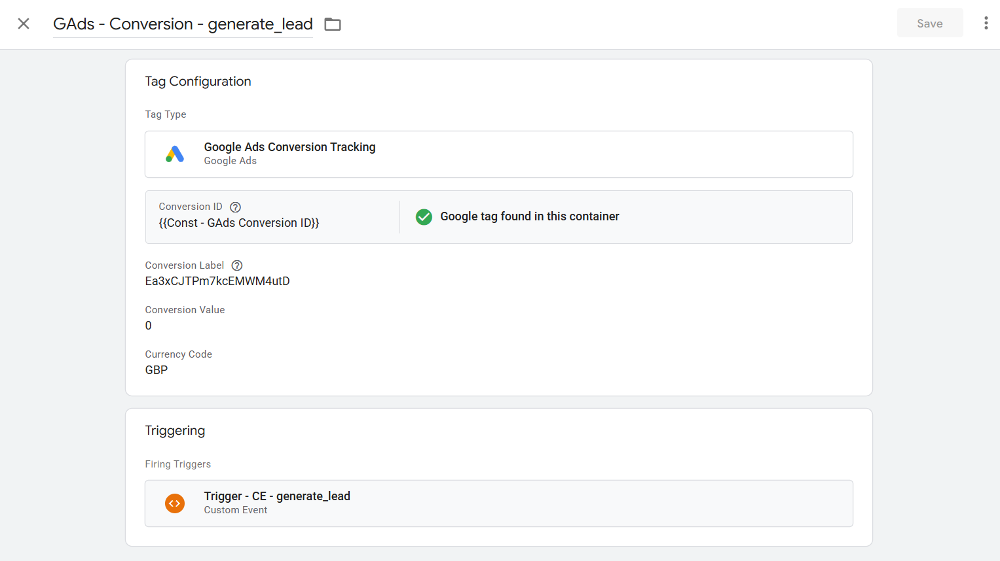

**Tag type:** Google Ads Conversion Tracking
**Tag name:** `GAds - Conversion - generate_lead`

| Field            | Value                          |
| ---------------- | ------------------------------ |
| Conversion ID    | `18211178053`                  |
| Conversion Label | `Ea3xCJTPm7kcEMWM4utD`         |
| Conversion Value | `0` (static)                   |
| Currency Code    | `GBP`                          |
| Trigger          | `Trigger - CE - generate_lead` |

> **Conversion value:** Static `0` for now. `DLV - lead_value` is created and available but not wired to this tag. Dynamic value assignment is implemented in 1.18 Lead Quality Tracking.

> **Why no beacon config needed here:** Google Ads conversion hits are routed through the `GAds - Config` Google tag (`AW-18211178053`), which automatically uses beacon transport for queued hits on page navigation. No explicit configuration required.

> **Why direct tag (not GA4 import):** Conversion tracking architecture for this project is Option A — direct Google Ads conversion tags in GTM. GA4 is linked to Google Ads for audiences and reporting only, not for conversion import. See 1.5 Google Ads Foundation.

---

### Trigger Configuration

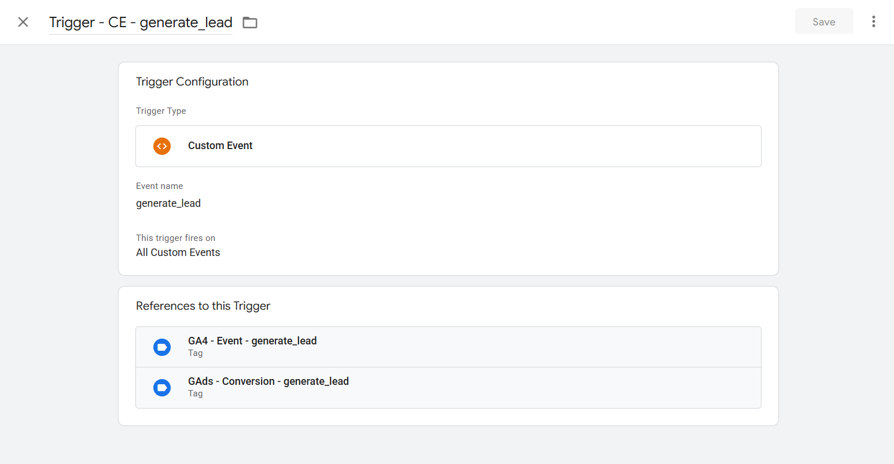

**Trigger type:** Custom Event
**Trigger name:** `Trigger - CE - generate_lead`
**Event name:** `generate_lead`
**Fires on:** All Custom Events

---

### Variable Configuration

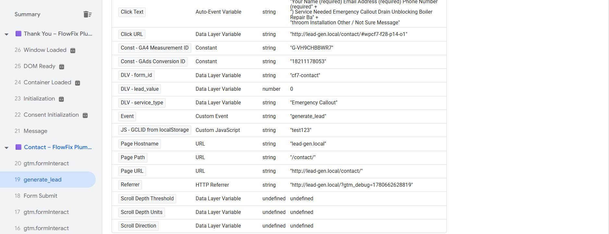

| Variable Name        | Type                | Data Layer Key | Notes                                          |
| -------------------- | ------------------- | -------------- | ---------------------------------------------- |
| `DLV - form_id`      | Data Layer Variable | `form_id`      | Version 2                                      |
| `DLV - service_type` | Data Layer Variable | `service_type` | Version 2                                      |
| `DLV - lead_value`   | Data Layer Variable | `lead_value`   | Version 2 — created now, wired to tags in 1.18 |

---

### GTM Version

**Version name:** `v1.6.0 - Contact Form Tracking`
**Export:** `gtm/GTM-5K9QS6NZ_v3.json`

---

## GA4 Configuration

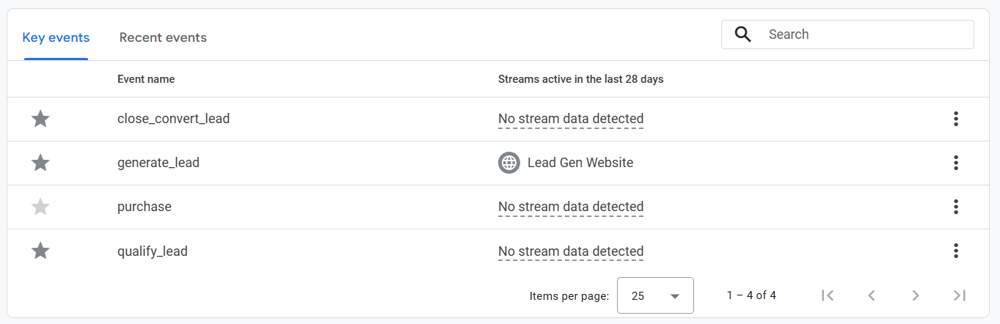

- **Event name:** `generate_lead`
- **Marked as key event:** Yes
- **Custom dimensions used:** `form_id` (registered in 1.4), `service_type` (registered in 1.4)

**How to mark as key event:** GA4 Admin → Data display → Events → Key events tab → once `generate_lead` appears in the Recent events tab (after first real post-publish form submission), click the star icon next to it.

> **Timing note:** The event appears in the Recent events list within 24 hours of the first real (non-debug) form submission after GTM is published. Do not use the "Create event" flow in GA4 — that creates a derived event from an existing one and causes duplicate key event counts.

---

## Google Ads Configuration

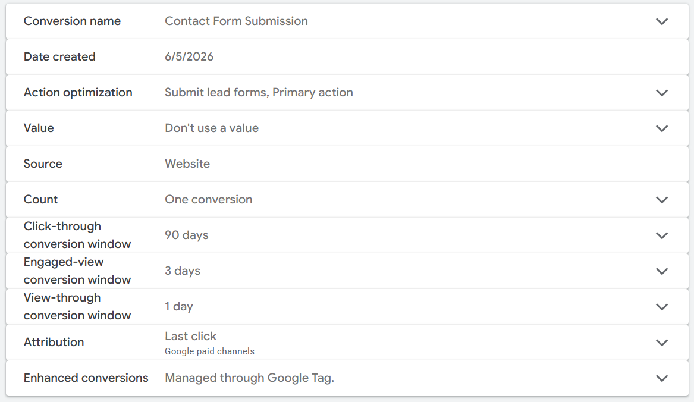

- **Conversion action name:** `Contact Form Submission`
- **Category:** Submit lead form
- **Value:** `0` (use the same value for each conversion)
- **Currency:** GBP
- **Count:** One
- **Click-through conversion window:** 90 days (matches GCLID `localStorage` expiry from 1.3)
- **View-through conversion window:** 1 day
- **Attribution model:** Last click
- **Action optimisation:** Primary action used for bidding optimisation
- **Import method:** Direct tag in GTM (`GAds - Conversion - generate_lead`)
- **Conversion ID:** `18211178053`
- **Conversion Label:** `Ea3xCJTPm7kcEMWM4utD`

> **Note:** When creating the conversion action, Google Ads shows a warning: "'Submit lead form' is not an account default goal." This is expected — the action is campaign-level, not account-default. It will appear in the Conversions column when assigned to a campaign.

---

## Validation Steps

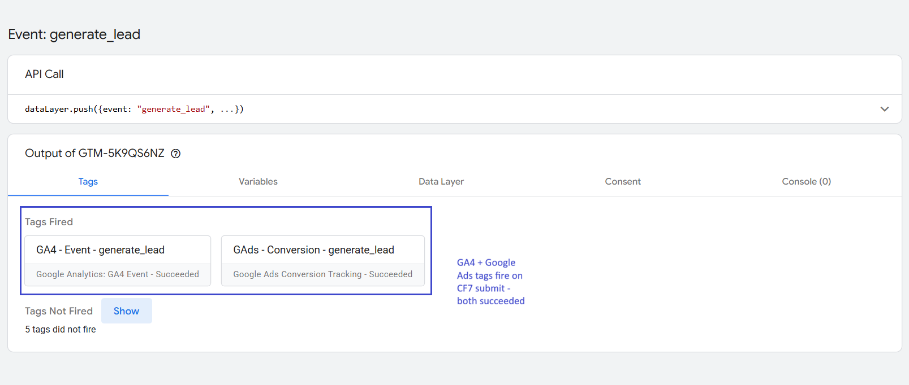

1. Open GTM Preview → enter `http://lead-gen.local` → Connect
2. Navigate to `/contact/` → fill in the form (select a service from the dropdown) → submit
3. In the Preview event stream, confirm `generate_lead` appears exactly once
4. Click the `generate_lead` event → **Tags** tab → confirm both show **Fired**:
   - `GA4 - Event - generate_lead`
   - `GAds - Conversion - generate_lead`
5. Click **Variables** tab on the `generate_lead` event → confirm:
   - `DLV - form_id` = `"cf7-contact"`
   - `DLV - service_type` = the dropdown value selected
   - `DLV - lead_value` = `0`


6. Open GA4 → Admin → DebugView
7. Submit another test form → confirm `generate_lead` appears in the event stream
8. Expand the event → confirm `form_id` and `service_type` parameters are present with correct values

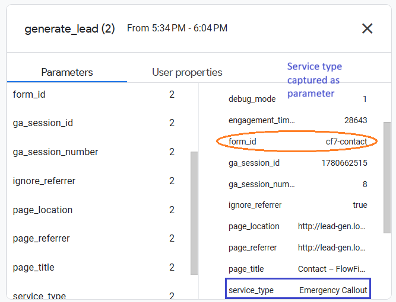

9. Confirm no duplicate `generate_lead` events in DebugView for a single submission
10. Confirm page redirects to `/thank-you/` after submission

---

## QA Checklist

- [ ] `generate_lead` fires on CF7 form submit — not on page load, not on validation error
- [ ] `generate_lead` fires exactly once per submission — no duplicates
- [ ] `DLV - form_id` = `"cf7-contact"`
- [ ] `DLV - service_type` = correct dropdown value selected in form
- [ ] `DLV - lead_value` = `0`
- [ ] `GA4 - Event - generate_lead` tag shows Fired in GTM Preview
- [ ] `GAds - Conversion - generate_lead` tag shows Fired in GTM Preview
- [ ] No tags in "Tags Not Fired"
- [ ] GA4 DebugView confirms `generate_lead` with `form_id` and `service_type` parameters
- [ ] `transport_type` does NOT appear as an event parameter in GA4 DebugView
- [ ] Page redirects to `/thank-you/` after submission
- [ ] `generate_lead` marked as key event in GA4 (star icon — may require up to 24h after first real submission post-publish)
- [ ] GTM container published as `v1.6.0 - Contact Form Tracking`
- [ ] Container JSON exported to `gtm/GTM-5K9QS6NZ_v3.json`

---

## Common Errors & Fixes

| Error / Symptom                                                                 | Root Cause                                                                                          | Fix                                                                                                                                  |
| ------------------------------------------------------------------------------- | --------------------------------------------------------------------------------------------------- | ------------------------------------------------------------------------------------------------------------------------------------ |
| `generate_lead` does not appear in GTM Preview after form submit                | WPCode snippet not Active, or set to Header instead of Footer                                       | WPCode → check status is Active and location is Footer                                                                               |
| Both conversion tags show Not Fired                                             | Custom Event trigger event name mismatch                                                            | Edit `Trigger - CE - generate_lead` → verify event name is exactly `generate_lead` (no hyphens, no spaces)                           |
| GA4 hit dropped — not appearing in DebugView after redirect                     | `transport_type: beacon` not set on GA4 Config tag                                                  | Open `GA4 - Config` → Fields to Set → add `transport_type = beacon`                                                                  |
| `transport_type` appears as a parameter in GA4 DebugView                        | Added to Event Parameters on the GA4 Event tag instead of Fields to Set on GA4 Config               | Remove from `GA4 - Event - generate_lead` Event Parameters; add to `GA4 - Config` → Fields to Set                                    |
| `generate_lead` fires twice on one submission                                   | GA4 Enhanced Measurement Form Interactions is enabled                                               | GA4 Admin → Data Streams → Enhanced Measurement → disable Form interactions                                                          |
| `service_type` parameter is empty string                                        | User submitted without selecting a service, or CF7 field name is wrong                              | Confirm CF7 field name is exactly `your-service`; test by selecting a dropdown value before submitting                               |
| Google Ads conversion tag fires in GTM but no conversion recorded in Google Ads | Conversion action not yet active, or MCC cross-account conversion tracking overriding child account | Check Google Ads → Goals → Conversions → status Active. Confirm MCC cross-account conversion tracking is disabled for `347-722-8703` |
| `generate_lead` doesn't appear in GA4 Recent Events list                        | GTM container not published, or only fired in Debug/Preview mode                                    | Publish container → submit form in incognito (non-debug) → wait up to 24h                                                            |

---

## Reusable Assets

- **GTM Container Export:** `project-lead-gen/gtm/GTM-5K9QS6NZ_v3.json`
- **WPCode Snippet:** `project-lead-gen/data-layer/snippets/generate-lead-cf7.js`

---

## Related Guides

- `guides/02-data-collection/gtm/form-tracking.md` — extracted from this subproject; covers CF7 event-based tracking pattern
- `guides/04-advertising-measurement/google-ads/conversion-actions.md` — Google Ads conversion action setup and Option A vs B architecture
- `project-lead-gen/docs/03-gtm-foundation.md` — GCLID capture setup referenced by conversion windows
- `project-lead-gen/docs/05-google-ads-foundation.md` — three-tag baseline required before this subproject
- `project-lead-gen/docs/08-thank-you-page-tracking.md` — page-load-based conversion pattern on the same form
- `project-lead-gen/docs/14-enhanced-conversions.md` — adds `user_data` to this push; configures Enhanced Conversions on `GAds - Conversion - generate_lead`
- `project-lead-gen/docs/18-lead-quality-tracking.md` — wires `DLV - lead_value` to `GAds - Conversion - generate_lead` with dynamic values
