# 1.7 — AJAX Form Tracking

## What This Does & Why

Not every form on a lead gen site uses the same plugin. FlowFix Plumbing has a Contact Form 7 form on `/contact/` (tracked in 1.6), but a second "Get a Quote" form on `/get-a-quote/` built with WPForms. WPForms submits via AJAX by default — the page never reloads on success. This breaks the CF7 tracking pattern entirely: there is no `wpcf7mailsent` event, no redirect to intercept, and no page load on which to fire a GTM Page Path trigger.

This subproject implements AJAX form tracking for WPForms using a GTM Custom HTML tag that attaches a jQuery event listener for `wpformsAjaxSubmitSuccess`. When the listener fires, it reads the selected dropdown values from the live form DOM and pushes a `generate_lead` event to the dataLayer — the same event name used by CF7, differentiated by `form_id`. The same GTM Custom Event trigger and GA4/Google Ads tags from 1.6 pick it up without modification. A new `property_type` parameter is added to this form (and registered as a GA4 custom dimension) to capture residential vs. commercial job type — useful for lead quality segmentation in future subprojects.

---

## Prerequisites

- [ ] GTM container at v5 (`v1.6.0 - Contact Form Tracking`) — `GA4 - Event - generate_lead`, `GAds - Conversion - generate_lead`, and `Trigger - CE - generate_lead` all exist
- [ ] `DLV - form_id`, `DLV - service_type`, `DLV - lead_value` variables exist in GTM (created in 1.6)
- [ ] GA4 property `Lead Gen Demo` (`G-VH9CHBBWR7`) with `form_id` and `service_type` custom dimensions registered (1.4)
- [ ] Google Ads conversion action `Contact Form Submission` (label: `Ea3xCJTPm7kcEMWM4utD`) exists (1.6)
- [ ] WPForms free tier installed and activated on WordPress
- [ ] `/get-a-quote/` page created in WordPress

---

## Business Requirement

Capture every successful WPForms AJAX form submission on `/get-a-quote/` as a `generate_lead` Google Ads conversion — using the same conversion action as the CF7 form — with `form_id`, `service_type`, and `property_type` parameters sent to GA4, so that both lead sources pool their signal into one Smart Bidding conversion stream while remaining distinguishable in GA4 reporting by `form_id`.

---

## Data Layer Specification

### Event Name

`generate_lead`

### Event Parameters

| Parameter       | Type   | Example Value     | Notes                                                                                                                                                                                                                                                             |
| --------------- | ------ | ----------------- | ----------------------------------------------------------------------------------------------------------------------------------------------------------------------------------------------------------------------------------------------------------------- |
| `form_id`       | string | `"wpforms-quote"` | Hardcoded string. Distinguishes this form from `cf7-contact` in GA4 reporting.                                                                                                                                                                                    |
| `service_type`  | string | `"Boiler Repair"` | Value of the Service Required dropdown at submission time. Same values as CF7: `Emergency Callout`, `Drain Unblocking`, `Boiler Repair`, `Bathroom Installation`, `Other / Not Sure`. Read from `$form.find('.wpforms-field-select').eq(0).find('select').val()`. |
| `property_type` | string | `"Commercial"`    | Value of the Property Type dropdown. One of: `Residential`, `Commercial`. Read from `$form.find('.wpforms-field-select').eq(1).find('select').val()`. New in 1.7 — registered as GA4 custom dimension in this subproject.                                         |
| `lead_value`    | number | `0`               | Hardcoded to 0. Dynamic value assignment in 1.18.                                                                                                                                                                                                                 |

> **Field order dependency:** The `.wpforms-field-select` selectors rely on Service Required being the first dropdown in the form and Property Type being the second. If the form field order changes, update `eq(0)` and `eq(1)` accordingly.

> **Deferred:** `user_data` (email, phone) excluded intentionally — added in 1.14 Enhanced Conversions.

### Full dataLayer Code

This code lives inside the GTM Custom HTML tag `Custom HTML - WPForms AJAX Tracking`. It is not a standalone snippet file — the jQuery listener is attached inline via GTM on page load.

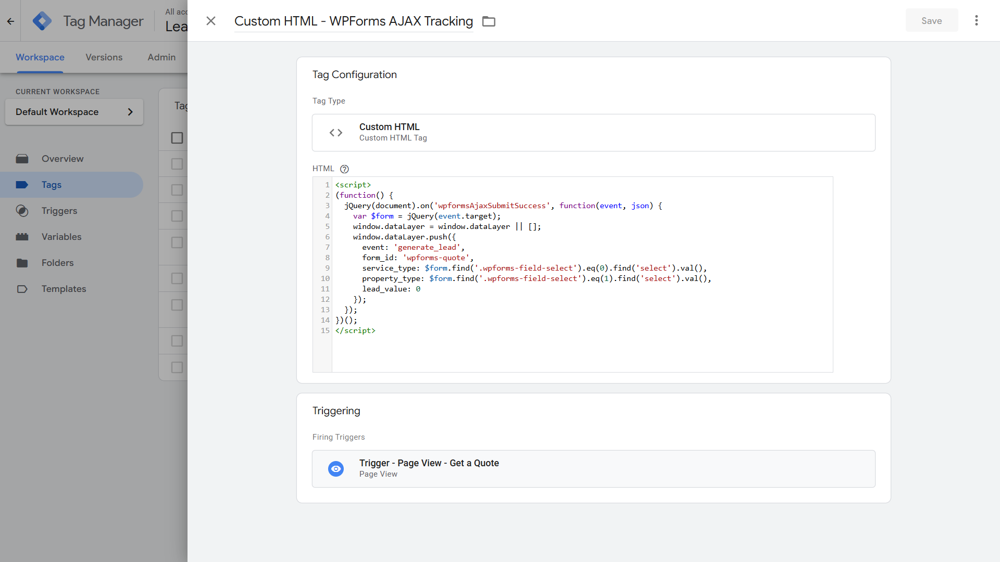

```javascript
<script>
(function() {
  jQuery(document).on('wpformsAjaxSubmitSuccess', function(event, json) {
    var $form = jQuery(event.target);
    window.dataLayer = window.dataLayer || [];
    window.dataLayer.push({
      event: 'generate_lead',
      form_id: 'wpforms-quote',
      service_type: $form.find('.wpforms-field-select').eq(0).find('select').val(),
      property_type: $form.find('.wpforms-field-select').eq(1).find('select').val(),
      lead_value: 0
    });
  });
})();
</script>
```

**Why `jQuery(event.target)` not the `$form` callback parameter:** WPForms 1.10.x triggers `wpformsAjaxSubmitSuccess` without passing the form as a callback argument. The event fires on the form element and bubbles to document, so `event.target` is the form. Using the callback's third parameter returns `undefined` in this version and throws a TypeError that breaks the form's loading state.

**Why a GTM Custom HTML tag and not WPCode:** In 1.6, WPCode (footer) was used because the dataLayer push needed to fire before a page redirect. Here there is no redirect — the form shows an inline confirmation. A GTM Custom HTML tag is clean and appropriate. (Note: WPCode header snippets cannot be used for pre-GTM pushes because GTM4WP fires its `<head>` snippet before WPCode header snippets load — but this is irrelevant here since we are not doing a pre-GTM push.)

---

## GTM Setup

### Step-by-Step Instructions

**Part A — WordPress setup**

1. Create a new WordPress page: Title `Get a Quote`, slug `/get-a-quote/`. Publish.
2. Add to nav: Appearance → Menus → add `Get a Quote`.
3. WPForms → Add New → Blank Form. Name: `Quote Request`.
4. Add fields in this exact order (order determines selector index):
   - Single Line Text: `Name` (required)
   - Email: `Email` (required)
   - Phone: `Phone` (required)
   - Dropdown: `Service Required` (required) — options: `Emergency Callout`, `Drain Unblocking`, `Boiler Repair`, `Bathroom Installation`, `Other / Not Sure`
   - Paragraph Text: `Message`
   - Dropdown: `Property Type` (required) — options: `Residential`, `Commercial`
5. Settings → Confirmation → Type: **Message** (not Redirect). Save form.
6. Edit the `/get-a-quote/` page. Add WPForms block → select `Quote Request`. Publish.
7. Load `/get-a-quote/` in browser. Submit a test entry. Confirm inline confirmation appears with no page reload. Verify in Network tab that a POST to `admin-ajax.php` fires and returns 200.

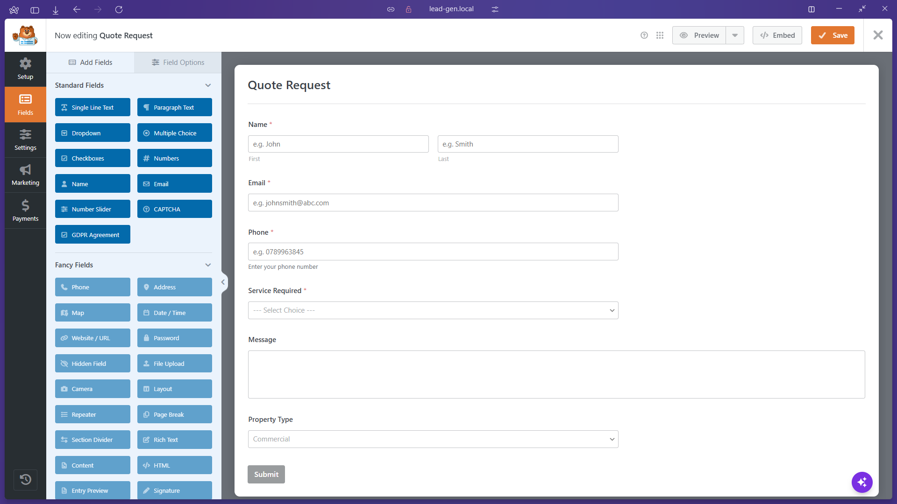

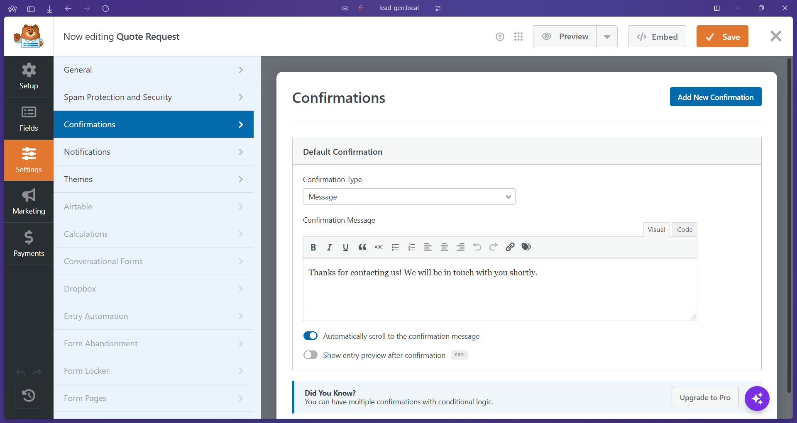

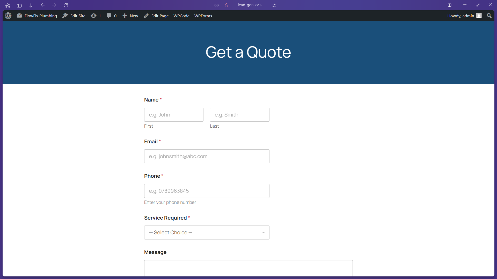

**Part B — GTM variable**

8. GTM → Variables → New:
   - Type: Data Layer Variable
   - Data Layer Variable Name: `property_type`
   - Name: `DLV - property_type`
   - Save.

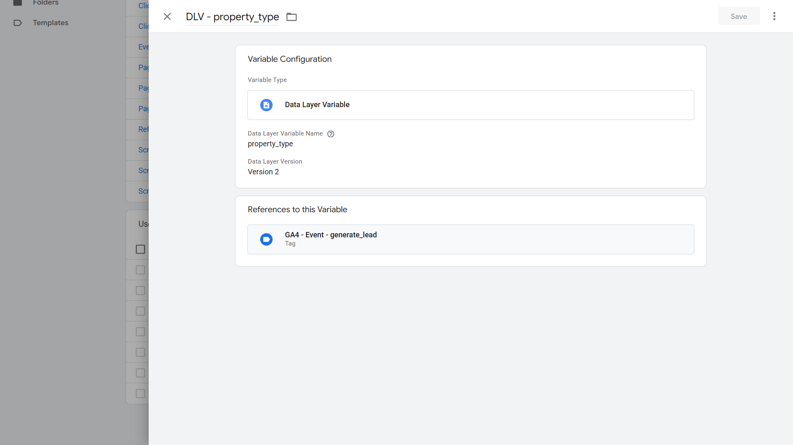

**Part C — GTM trigger**

9. GTM → Triggers → New:
   - Type: Page View
   - Fire on: Some Page Views
   - Condition: Page Path — contains — `/get-a-quote/`
   - Name: `Trigger - Page View - Get A Quote`
   - Save.

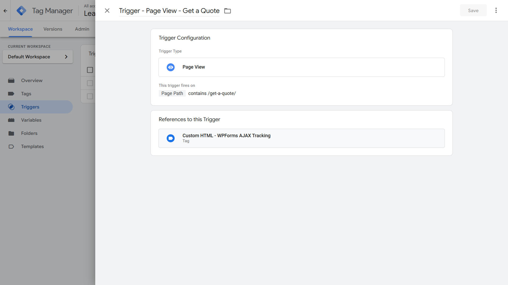

**Part D — GTM Custom HTML tag**

10. GTM → Tags → New:
    - Type: Custom HTML
    - Name: `Custom HTML - WPForms AJAX Tracking`
    - HTML: paste the full script block from the Data Layer Specification above
    - Triggering: `Trigger - Page View - Get A Quote`
    - Save.


**Part E — Update existing GA4 Event tag**

11. Open `GA4 - Event - generate_lead`. Under Event Parameters, add a third row:
    - Parameter Name: `property_type`
    - Value: `{{DLV - property_type}}`
    - Save.

    For CF7 submissions, `DLV - property_type` returns `undefined` — GA4 simply omits the parameter. No impact on existing CF7 tracking.

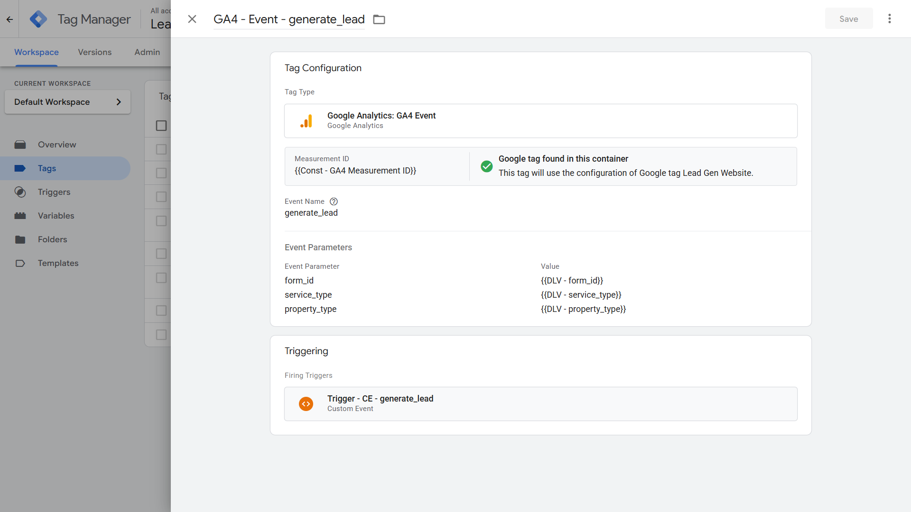

> **GAds - Conversion - generate_lead:** No changes needed. It already fires on `Trigger - CE - generate_lead`, which picks up `generate_lead` from any source.

### Tag Configuration

**Custom HTML - WPForms AJAX Tracking**

**Tag type:** Custom HTML
**Tag name:** `Custom HTML - WPForms AJAX Tracking`
**Key settings:**

- HTML: jQuery document-level listener for `wpformsAjaxSubmitSuccess` (see Full dataLayer Code)
- Support document.write: Off (default)
- Triggering: `Trigger - Page View - Get A Quote`

### Trigger Configuration

**Trigger - Page View - Get A Quote**

**Trigger type:** Page View
**Trigger name:** `Trigger - Page View - Get A Quote`
**Conditions:**

- Page Path — contains — `/get-a-quote/`

**Why Page View (not All Pages):** The jQuery listener only needs to be attached on the page where the form lives. The listener is passive — it has no effect unless the form is submitted. Scoping to `/get-a-quote/` keeps the container clean.

**Why the GA4 and GAds event tags do NOT need this trigger:** They fire on `Trigger - CE - generate_lead` (Custom Event), which fires whenever `generate_lead` is pushed to the dataLayer — regardless of page. The Page View trigger is only for attaching the listener.

### Variable Configuration

**DLV - property_type**

- Type: Data Layer Variable
- Data Layer Variable Name: `property_type`
- Default Value: (empty)

### GTM Version

**Version name:** `v1.7.0 - AJAX Form Tracking`
**Export:** `gtm/GTM-5K9QS6NZ_v4.json`

---

## GA4 Configuration

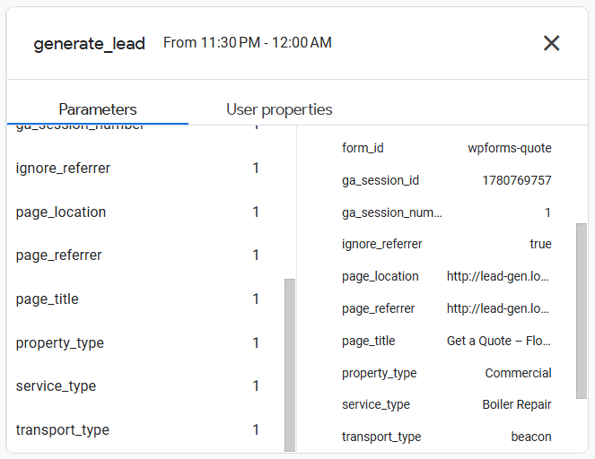

- **Event name:** `generate_lead`
- **Marked as key event:** Yes (carried over from 1.6 — no change needed)
- **Custom dimensions registered in this subproject:**

| Dimension name | Event parameter | Scope |
| -------------- | --------------- | ----- |
| Property Type  | `property_type` | Event |

**To register:** GA4 Admin → Custom Definitions → Custom Dimensions → Create. Dimension name: `Property Type`, Scope: Event, Event parameter: `property_type`.

**Also update:** `project-lead-gen/docs/04-ga4-foundation.md` — add a note to the custom dimensions table:

> `Property Type` (`property_type`) added in 1.7 — AJAX Form Tracking.

**Note on `transport_type: beacon` in DebugView:** GA4 DebugView shows `transport_type: beacon` as a parameter on the `generate_lead` event. This is expected — it reflects the `transport_type: beacon` field set on the GA4 Config tag in 1.6. It is not a bug.

---

## Google Ads Configuration

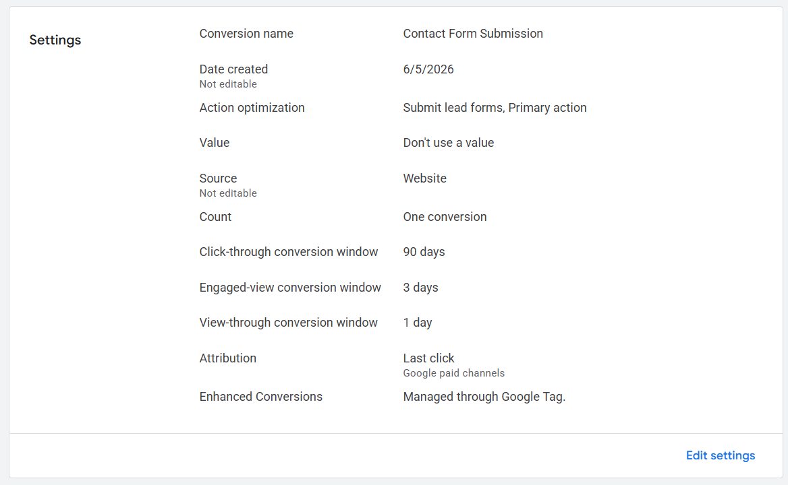

- **Conversion action name:** `Contact Form Submission` (existing — no new action created)
- **Conversion label:** `Ea3xCJTPm7kcEMWM4utD`
- **Category:** Submit lead form
- **Value:** 0 (static)
- **Count:** One
- **Click-through window:** 90 days
- **Attribution model:** Last click
- **Import method:** Direct GTM tag (`GAds - Conversion - generate_lead`)

**Why reuse the existing conversion action:** Both CF7 and WPForms produce the same business outcome — a lead. Splitting them into separate conversion actions divides the Smart Bidding signal across two thin streams. The `form_id` parameter in GA4 provides all the segmentation needed for reporting without fragmenting the conversion signal.

---

## Validation Steps

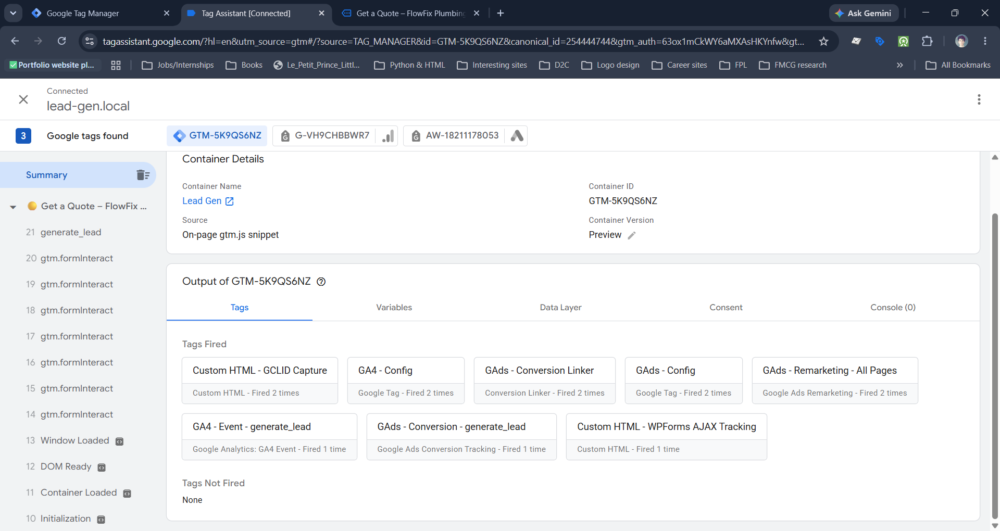

1. Open GTM Preview → navigate to `http://lead-gen.local/get-a-quote/`.
2. Confirm `Custom HTML - WPForms AJAX Tracking` is in Tags Fired on the page load event.
3. Fill in the form — select a service and a property type. Submit.
4. Confirm `generate_lead` appears in the GTM Preview event stream.
5. Click the `generate_lead` event → Tags tab — confirm:
   - `GA4 - Event - generate_lead` → Fired 1 time ✓
   - `GAds - Conversion - generate_lead` → Fired 1 time ✓
6. Click Variables tab on the `generate_lead` event — confirm:
   - `DLV - form_id` = `"wpforms-quote"` ✓
   - `DLV - service_type` = selected service value ✓
   - `DLV - property_type` = `"Residential"` or `"Commercial"` ✓
   - `DLV - lead_value` = `0` ✓

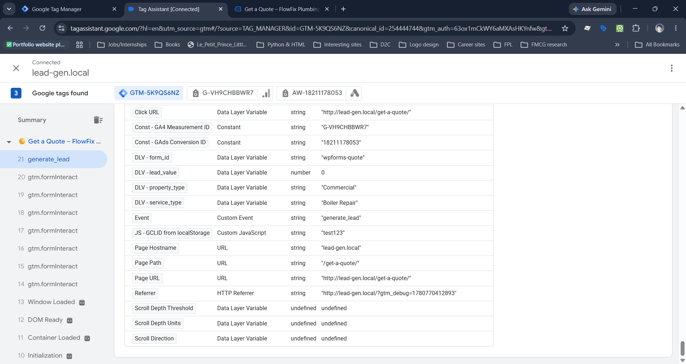

7. Check Console tab — confirm Console (0), no errors.
8. Open GA4 DebugView. Submit the form again. Confirm `generate_lead` shows `form_id: wpforms-quote`, `service_type`, and `property_type` all populated.

[Screenshot: GA4 DebugView generate_lead event expanded showing all parameters]

9. **Cross-check CF7:** Submit the CF7 form on `/contact/`. Confirm `generate_lead` fires with `form_id: cf7-contact`, no `property_type` parameter, and redirect to `/thank-you/` still works correctly.

---

## QA Checklist

- [ ] `generate_lead` fires on WPForms form submit, not on page load
- [ ] `generate_lead` does NOT fire on form validation errors (required fields missing)
- [ ] No duplicate `generate_lead` events on a single submission
- [ ] `DLV - form_id` = `wpforms-quote`
- [ ] `DLV - service_type` = correct selected dropdown value
- [ ] `DLV - property_type` = correct selected dropdown value
- [ ] `DLV - lead_value` = `0`
- [ ] Inline confirmation appears after submission (no page reload)
- [ ] GA4 DebugView confirms all three parameters on `generate_lead`
- [ ] `GAds - Conversion - generate_lead` fires once on submission
- [ ] CF7 form on `/contact/` unaffected — `generate_lead` still fires with `form_id: cf7-contact`
- [ ] Console (0) — no JavaScript errors in GTM Preview
- [ ] GTM version published as `v1.7.0 - AJAX Form Tracking`
- [ ] Container JSON exported → `gtm/GTM-5K9QS6NZ_v4.json`
- [ ] `Property Type` custom dimension registered in GA4
- [ ] Note added to `04-ga4-foundation.md` re: `property_type` added in 1.7

---

## Common Errors & Fixes

| Error / Symptom                                                                                                      | Root Cause                                                                                                                                                                                                                                                                 | Fix                                                                                                                                                                                                                                |
| -------------------------------------------------------------------------------------------------------------------- | -------------------------------------------------------------------------------------------------------------------------------------------------------------------------------------------------------------------------------------------------------------------------- | ---------------------------------------------------------------------------------------------------------------------------------------------------------------------------------------------------------------------------------- |
| Form stuck on loading spinner; `Uncaught TypeError: Cannot read properties of undefined (reading 'find')` in console | WPForms 1.10.x does not pass `$form` as a callback argument to `wpformsAjaxSubmitSuccess`. The third callback parameter is `undefined`. Calling `.find()` on it throws an uncaught TypeError that interrupts WPForms' own success handler before it can clear the spinner. | Use `function(event, json)` as the callback signature and derive the form reference with `var $form = jQuery(event.target)`. Since the event bubbles from the form element to document, `event.target` is always the correct form. |
| `service_type` or `property_type` returns empty string                                                               | The `.wpforms-field-select` selectors rely on field order in the DOM. If the form was built with dropdowns in a different order, `eq(0)` and `eq(1)` target the wrong fields.                                                                                              | Inspect the form DOM in DevTools. Confirm `.wpforms-field-select` containers appear in order: Service Required first, Property Type second. Reorder fields in WPForms builder if needed, then re-save the form.                    |
| `wpformsAjaxSubmitSuccess` never fires                                                                               | WPForms AJAX submission is disabled, or a page redirect confirmation is configured (which can switch WPForms to standard POST).                                                                                                                                            | Check WPForms Settings → Confirmation → Type is set to **Message**, not Redirect.                                                                                                                                                  |
| `Custom HTML - WPForms AJAX Tracking` not in Tags Fired on `/get-a-quote/`                                           | Trigger condition not matching the actual Page Path.                                                                                                                                                                                                                       | In GTM Preview Variables tab, check the exact value of Page Path. Confirm trigger condition is `contains` `/get-a-quote/`, not `equals`.                                                                                           |
| `generate_lead` fires but `property_type` absent from GA4                                                            | `DLV - property_type` not added to `GA4 - Event - generate_lead` Event Parameters.                                                                                                                                                                                         | Open the GA4 Event tag and add `property_type` → `{{DLV - property_type}}` as a third event parameter.                                                                                                                             |

---

## Reusable Assets

- **GTM Container Export:** `project-lead-gen/gtm/GTM-5K9QS6NZ_v4.json`
- **jQuery AJAX listener pattern:** The `jQuery(document).on('wpformsAjaxSubmitSuccess', function(event, json) { var $form = jQuery(event.target); ... })` pattern applies to any WPForms installation. The `jQuery(event.target)` approach for getting the form reference is the correct method for WPForms 1.10.x and later.

---

## Related Guides

- [1.6 Contact Form Tracking](06-contact-form-tracking.md) — CF7 event-based pattern; baseline for this subproject
- [1.8 Thank You Page Tracking](08-thank-you-page-tracking.md) — URL-based alternative; no dataLayer push required
- [1.12 HubSpot Forms Tracking](12-hubspot-forms-tracking.md) — similar callback interception pattern for HubSpot embedded forms
